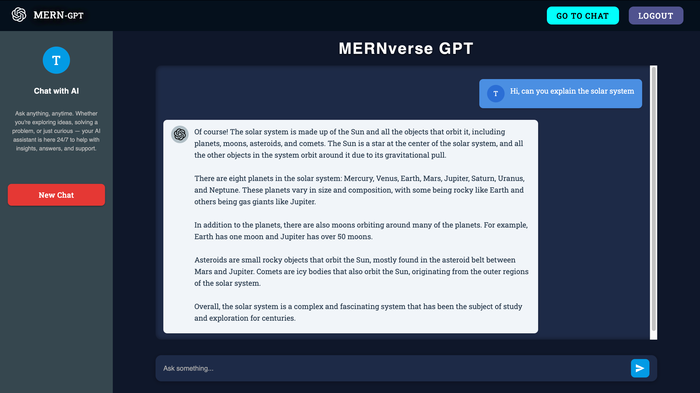
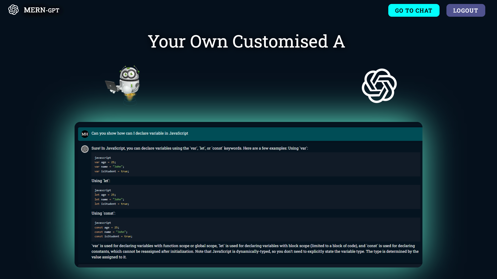
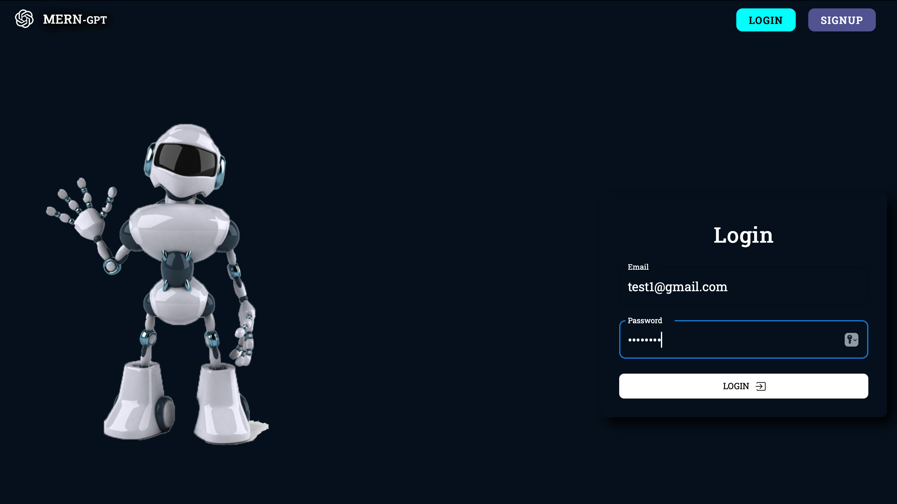

## AIChatHub

A lightweight AI assistant platform powered by the OpenAI API. This project replicates the core functionality of ChatGPT with a custom interface, secure authentication, and persistent user-specific chat history. Built to demonstrate a clean, minimal user experience and scalable backend integration.

## Core Features

- Secure user authentication with login and signup functionality  
- Persistent chat history stored per user for session continuity  
- Real-time chat interaction powered by OpenAI API  
- Responsive and user-friendly interface with clean design   
- Ability to view, manage, and delete past conversations

## Demo

### Chat Page  
The main interface where users interact with the AI assistant, view chat history, and send messages.  



### Home Page  
The landing page featuring an interactive welcome screen with a login button that directs users to the authentication page.  



### Login Page  
The page where users enter their credentials to access their accounts securely.  



## Download & Setup Instructions

### Step 1: Clone the repository

```bash
git clone https://github.com/ericfan20211215/AIChatHub.git
```

### Step 2: Install Dependencies

```bash
cd backend
```
```bash
npm install
```

```bash
cd ../frontend
```
```bash
npm install
```
### Step 3: Configure Environment Variables

Create a .env file inside the backend folder and add your credentials:

```bash
OPEN_AI_SECRET=your_openai_api_key
OPEN_AI_ORGANISATION_ID=your_openai_organization_id
MONGODB_URL=your_mongodb_connection_string
JWT_SECRET=your_jwt_secret
COOKIE_SECRET=your_cookie_secret
```

Important:
- Replace placeholders with your own values.
- This project uses the gpt-3.5-turbo model — ensure your OpenAI API key has access to it.
- You must have a MongoDB database set up (e.g., MongoDB Atlas) and use its connection string for MONGODB_URL.

### Step 4: Running the project locally

1. **Start the backend server**
   ```bash
   cd backend
   npm run dev
   ```
   
2. **Start the frontend app**
   ```bash
   cd ../frontend
   npm run dev
   ```


